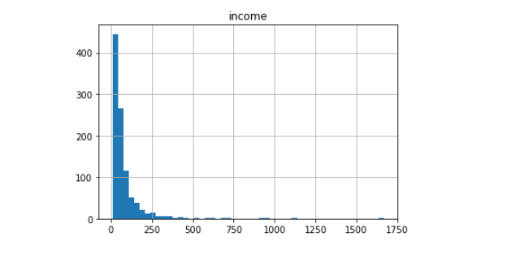
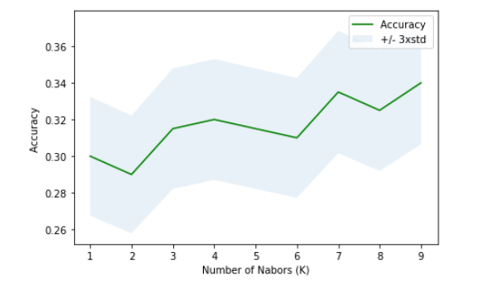

# TelecommunicationUserCategory-KNN
<h1>Shagoto Rahman Shrestho</h1>
<h3> a telecommunications provider has segmented its customer base by service usage patterns, categorizing the customers into four groups. If demographic data can be used to predict group membership, the company can customize offers for individual prospective customers. It is a classification problem. That is, given the dataset, with predefined labels, we need to build a model to be used to predict class of a new or unknown case. 
The example focuses on using demographic data, such as region, age, and marital, to predict usage patterns. 
The target field, called custcat, has four possible values that correspond to the four customer groups, as follows: 1- Basic Service 2- E-Service 3- Plus Service 4- Total Service
Our objective is to build a classifier, to predict the class of unknown cases. We will use a specific type of classification called K nearest neighbour.</h3>

So here we have used KNN to predict classes and the best value for k for prediction

So here the best k is 9.Check out the tele.ipynb and understand the total process.
